# Producing and programming a circuit board with ATtiny412

This is a video showing the circuit board that I made:

<video controls src="img/ButtonBlinkingLandscape.mp4" title="ButtonBlinking"></video>


## Done with directions from Andri Sæmundsson

[Andri Sæmundsson](https://fabacademy.org/2023/labs/akureyri/students/andri-semundsson/pages/aboutMe.html) made a series of videos for Fab Lab Reykjavík, where he explaines all the steps in producing a circuit board with ATtiny412. I followed his directions and here I describe every step I took.
## KiCad setup

!!!Info "The first part"
  
    In the first [video](https://www.youtube.com/watch?v=iOPbk1W3X5k&list=PLs4ifnZzVJmqaSM1lsg68vPVtJxVNhVwV&index=1) he explains how to set up KiCad 8. 

On [KiCad.org](hhttps://www.kicad.org/download/windows/) I downloaded the KiCad program and then installed it on the computer. On the [About KiCad](https://www.kicad.org/about/kicad/) site it says that KiCad is an open source software that can be used to design EDA or Electronic Design Automation. In [KiCad](https://www.kicad.org/) Schematic Editor is used to draw electronic circuit and you have access to thousands of symbols that can be found in libraries. The PCB Editor is then used to add elements to the circuit. Then you can use the 3D viewer to preview your design.

I opened the program, clicked on **File** and **new** to create a new project. I saved it in a folder in my computer. When saving a new project there will be two files created, Schematic file and a PCB file. I began by editing the Schematic file.

!!! note inline end "Schematic and PCB files"

    When saving a new project there will be two files created, Schematic file and a PCB file. 

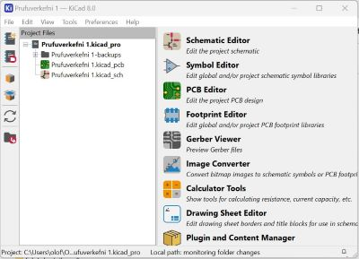

## Hiding libraries and adding Fab Lab library

!!!Info "The second part"
  
    In this [video](https://www.youtube.com/watch?v=ZeAAy6L8AB8&list=PLs4ifnZzVJmqaSM1lsg68vPVtJxVNhVwV&index=2) he explains how to hide librarys that are seldom used and add a KiCad library. 


After watching the video I googled "Fab Lab library", as suggested in the video, and downloaded [this library](https://gitlab.fabcloud.org/pub/libraries/electronics/kicad). Then I clicked on the button marked as **Code** and chose **Zip**. Then I opened up the downloads folder and extracted the library. I saved this library in a folder where I plan on storing everything connected to working with KiCad.
The next step was to open KiCad, click on **Preferences** and **Manage Libraries**. This photo shows that there are many libraries and it can be hard to find the right library, so as [Andri Sæmundsson](https://fabacademy.org/2023/labs/akureyri/students/andri-semundsson/pages/aboutMe.html) mentioned in the video, it would be easier to work with a few libraries, but first I had to install the Fab Lab library before removing other libraries.


I clicked on the small button with a folder sign on it, opened up the folder with the library and double clicked on the **sym** file.

!!! info inline end "Inline blocks"

    Here you can see the tiny folder sign.


Then I clicked on **Preferences** and chose **Footprint Libraries**. I clicked on the **Folder** button and this time I added the Fab.Pretty folder.

After adding the Fab Lab library to the lists of libraries I took the clicks away from the box under **Active** in front of every other library. After that the only active library is the Fab Lab library.

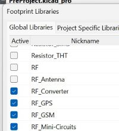

## Designing the circuit in Schematic Editor

!!!Info "Third, fourth and fifth part"
  
    In these three videos; [first part](https://www.youtube.com/watch?v=ZXyL5xjJb7w&list=PLs4ifnZzVJmqaSM1lsg68vPVtJxVNhVwV&index=3), [second part](https://www.youtube.com/watch?v=knyDOiUZNsc&list=PLs4ifnZzVJmqaSM1lsg68vPVtJxVNhVwV&index=4), [third part](https://www.youtube.com/watch?v=dM3h--A04W4&list=PLs4ifnZzVJmqaSM1lsg68vPVtJxVNhVwV&index=5) he explains how to use Scematic editor.


!!!Info inline end "Adding elements from Fab Lab Library"
  
    In the Schematic Editor, to add an element from the Fab Lab Library you either click on the symbol here to the right or you just click on the letter **A** on your keyboard.

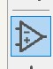


I wrote **ATtiny 412** and chose it from the list. To the right I could see the symbol for this microcontroller and below it there was an footprint image of it. Then I clicked **ok**. I could drag it around and I placed it on the screen by leftclicking on the screen. To add a switch I opened the library again and wrote **Switch** and chose **Switch_Tactile_Omron** from the list. In the information text below I could see the letters **SMT**. SMT means that the button should be surface mounted.

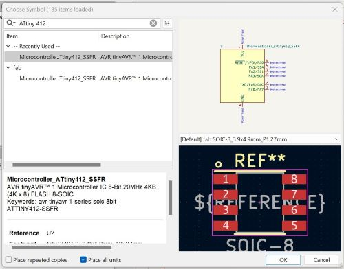

After that I added a capacitor with the number **C_1206**. Then I added a Led with the same number as the capacitor; **L_1206**. 

The last element that I added was a Conn_PinHeader with three male pins in a row.

Because the icon for the library is chosen, each time I click on the screen the library opens. To be able to use the mouse I had to click on the arrow at the top of the list. Then I could use the mouse to move elements around. 

To rotate an element you can write "R" and then the element rotates 90 degrees.

Elements can be labeled by clicking on the symbol marked with an underlined A or just writing the letter"L". I added a label marked GND to Ground and another one marked VCC to VCC. I labelled pin 6 as UPDI.. I labelled pin 7 as LED and also put a LED label on the resistor. Then I connected the other end of the resistor to the LED with wire.I labelled the other end of the LED with GND. 

I labelled one end of the capacitor with GND and the other end with VCC. I labelled one end of the switch as GND and the other one as BNT. 

The first pin on the PinHeader I labelled as VCC and the second one as GND. Pin nr. 3 was labelled as UPDI.

 I connected the led to pin 7, which is marked as PA3. Then I connected the LED to Ground. Then I connected the swithc to pin 2, which is marked as PA6. In Schematic Editor it looks as if Pins nr. 2 and 7 are on the same side but when you look at this photo of ATtiny 412 from [Spence Konde](https://github.com/SpenceKonde/megaTinyCore/raw/master/megaavr/extras/ATtiny_x12.gif) you can see that the pins are on each side.

I connected the first pin on the Conn_PinHeader to Ground, the second one to VCC and the third one to UPDI. 

I used the **Electrical Rule Checker** to see if everything was legal but got a few errors. After marking pins nr. 3, 4 and 5 with **No connection flag** and putting a **power flag** on **Ground** and **VCC*, the Electrical Rule Checker everything seemed to be okay.

In Page settings I changed the page size to A5 and added some information about the project. Then I added a text box, just to try it. I also put a rectangular frame around some of the elements and changed the style of the frame.

## First Schematic Editor, then PCB Editor

!!!Info "Sixth part"
  
    This [video](https://www.youtube.com/watch?v=2oxuvwRuQNM&list=PLs4ifnZzVJmqaSM1lsg68vPVtJxVNhVwV&index=6) explains how to use the PCB editor.


Before opening the PCB editor I changed the value of the capacitor and the resistor by clicking on each of these element and then clicking on the symbol for Properties. Another way to open the Properties manager is to right click on an element and choose the Properties manager from the list. The third way is simply to write the letter E and the fourth way is to double click on the text.
 I changed the value of the Capacitor from C_1206 to 1 uF, the value of the Resistor from R-1206 to 1k. Then I opened the PCB Editor by clicking on the symbol for it in the top bar.

 To fetch the elements from the Schematic Editor I clicked on **Update PCB Editor from Schematic**. Then a window popped up and I clicked on the Update PCB button.

 In the PCB Editor you can see different layers at the right side of the window, choose those layers you want to work with and hide all others. I was working with the top layer of the electric board and therefore I chose the F.Cu, or in other words; the front of the copper plate. Then I could hide the view of the backside by clicking on the **eye** in front of B.Cu.
 I hid all layers except the layers for F.Silkscreen, Edge.Cuts, F.Courtyard and .... The F.Courtyard shows a violet frame around elements and it shows how close you can lay wires to elements, f.ex. if you cross the violet frame you are too close to an element. 

I changed the setup of the pins by editing the labels in Schematic Editor; Pin1 changed from VCC to UPDI and Pin3 changed from UPDI to VCC. Then I clicked on **Update PCB Editor from Schematic**.

I could see that some of the blue lines, which showed how the electric circuits would be connected, were crossed. To fix that I by rotating elements.

When organizing the board I had to make sure that I wouldn´t make the circuits too thin and that there is enough space for the bit to mill the traces while making sure that there is enough clearance.
In **Board Setup** I went to **Design rules** and wrote that mininum clearance, minimum track width, minimum connection width, minimum annular width and copper to hole clearance should all be 0.4mm.

To connect the elements/making tracks for the circuits that I wanted to mill, I clicked on the **Route Tracks** symbol and began drawing tracks between footprints. I made sure that the lines were straight when entering footprints. I used the Route tracker to mark all circuits that had to be milled, as can be seen in this photo. 

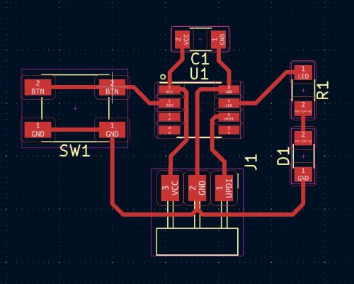

To see what the board would look like I clicked to the 3D viewer and saw that Kicad made no extra space around the circuit, so I chose the Edge.Cut layer, clicked on the rectangular symbol and drew a rectangle around the circuit, giving it more space around all elements. This is what it looked like in 3D view after that.

## 3D models added and then inspected in 3D viewer

!!!Info "Seventh part"
  
    In this [video](https://www.youtube.com/watch?v=oObZeXe6Ba8&list=PLs4ifnZzVJmqaSM1lsg68vPVtJxVNhVwV&index=7) he adds 3D model to his PCB and uses the 3D viewer. 

To add 3D models to my board I right clicked on each element, chose **properties** and then clicked on **3D models** in the top bar. Then I had to click on the line that was lighted up with blue because then a small folder logo appeared beside the text. After that I clicked on this **small folder symbol**, searched for the **Fab Lab Library** and opened it. In it I found the **Fab.3Dshapes** folder and opened it to find **R_1206.step** and finally click on **OK**. When I opened up the 3D viewer I could see that the Resistor appeared in 3D on the board.

There was no 3D model for ATtiny4012, led light and button in Fab.3Dshapes, so [Andri Sæmundsson](https://fabacademy.org/2023/labs/akureyri/students/andri-semundsson/pages/aboutMe.html) explained in the video what to do and pointed to this [website](https://www.snapeda.com/) to find the 3D model. I had to sign up to be able to use the website. Then I used the search window to find each element, chose the right one from a list and downloaded a 3D model. I opened the download in the downloads folder, copied it and pasted it into the **Fab.3Dshapes** folder. After that I could find the models in the same way as I explained before. The only problem was that when these models were opened up in Kicad-properties-3D models-Fab.3Dshapes they didn´t sit on the plate but lay on their side. That was easily fixed just by rotating them about 90 degrees.

  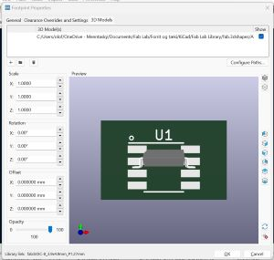        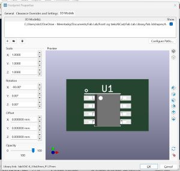     


!!!note
    Check out if the elements you add to Fab.3Dshapes folder are at the right angle. If not, rotate the angle on x-axis.

## Design Rule Checker


!!!Info "Eight part"
  
     [Here](https://www.youtube.com/watch?v=Tq6v1HqWmm0&list=PLs4ifnZzVJmqaSM1lsg68vPVtJxVNhVwV&index=8) [Andri Sæmundsson](https://fabacademy.org/2023/labs/akureyri/students/andri-semundsson/pages/aboutMe.html) shows how to finish the design of the board in PCB editor, use Design Rules Checker and finally prepare the design for milling and cutting in Inkscape.

  I followed the directions on how to use **Design Rule Checker** to see if everything is legal. I clicked on the symbol for it and chose **Run DRC**. I got 6 warnings that said "Silkscreen clipped by solder mask". Andri said that it would be important to fix this if the board was to be produced, but since this doesn´t really matter when this board is made, i ignored the warnings. 

 To export the final desing I chose **File** and **Export SVG**. I checked in the **F.Cu box** and changed the **Print Mode** from color to **black and white**. Then I saved the file. The next step was to open the file in Inkscape. The whole page appeared in Inkscape with the frame around the page and the text boxes. I only needed the board, so I copied it and pasted it into a new Inkscape file. In Inkscape I changed the colour of the circuit from black to white and changed the background to black.

I had to make two files in Inskcape, one for milling the circuit and another one for cutting the outline, because these two files are cut with different bits. To make the file for the outline I copied the outline and pasted it beside the other one. Then I copied it again and pasted exactly the same rectangle, but coloured it white. In the boxes for height and width I extracted 1,6mm from the numbers by writing -1,6 in both boxes. Then I selected both rectangles, went to **Object** and **Align and distribute**. Then I aligned the rectangles on x-axis and y-axis. Now I had an outline that was 0,8mm wide and that was a good size for the cutting line because the bit that will be used is just under 0,8mm. 

Finally, I saved a new Inkscape file with the outline drawing, then selected the drawing of the outline and exported it as PNG. Then I also exported the drawing of the circuit as PNG.

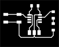


## Milling and cutting with Fab Mods

!!!Info "Ninth part"
  
    In this video it is shown how to mill the board by using Fab Modules [here](https://www.youtube.com/watch?v=zJNpHpuvNjk&list=PLs4ifnZzVJmqaSM1lsg68vPVtJxVNhVwV&index=9). 


In our Fab Lab we have the [MonoFab SRM-20 milling machine](https://www.rolanddg.eu/en/products/3d/srm-20-small-milling-machine). 

Since [Andri Sæmundsson](https://fabacademy.org/2023/labs/akureyri/students/andri-semundsson/pages/aboutMe.html) was not using the same machine as I was using, I also watched this video made by Fab Lab Barcelona [here](https://www.youtube.com/watch?v=rFRuc0VPWDM) and compaired it to the video that Andri made. Another thing; Andri was also using [Fab Modules](https://kokompe.cba.mit.edu/) but in our Fab Lab we use Fab Mods, which is a newer edition, for setup before cutting and milling in the MonoFab SRM-20 machine. It is done online with [Fab Mods](https://modsproject.org/). I opened the website and right clicked on the screen for this window to open up. Then I chose **Programs** and then I chose **Mill 2D PCB** which was under **SRM-20 mill**.


!!! info inline end "Inline blocks"

    I opened the website and right clicked on the screen for this window (upper left photo) to open up. 
    
    
    
    
    
    Then I chose **Programs** and clicked on **Mill 2D PCB** which was under **SRM-20 mill** (lower left photo).
             
             


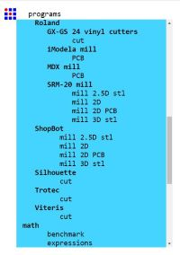


## Settings in Fab Mods

After going through the process I mentioned here above, this page appeared:
 
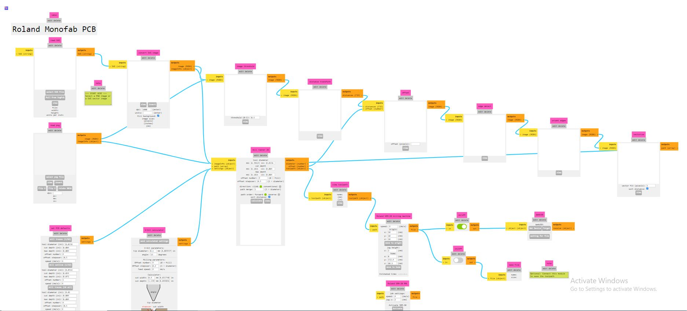

At first sight it looks very complicated to fill in the information, but in fact it is simpler than it looks. On the left side you can choose between uploading a .svg file or a .png file. I began by uploading the .png file for the electric circuits and clicked on the 1/64 button below, because I wanted to use the 1/64 endmill to mill the traces. 


!!! info inline end "Inline blocks"

    The 1/64 button with presettings. 
    
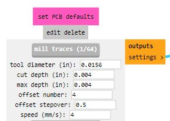


 
The next step was to turn on **Save** to the lower right, so that both **Save** buttons were turned on. The settings for x,y and z were preset to 10 but I changed them all to zero.

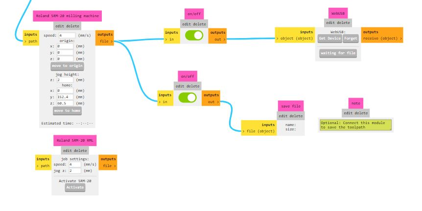

Finally I clicked on **Calculate** under **Mill raster 2D**.

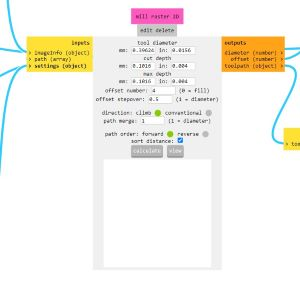

Then the program created paths and a photo of them appeared in the next tab on the browser. But the traces were not similar to the traces that Andri made, so I asked [Svavar Konráðsson](https://fabacademy.org/2023/labs/isafjordur/students/svavar-konradsson/index.html) and he asked what resolution I used when exporting the PNG from Inkscape. It was not high, so Svavar advised me to export the PNG with the resolution set to 1000 dpi. The results were much better and here you can see the difference between the path with lower resolution and the other one with higher resolution:

   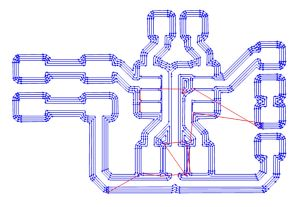

After prepairing the file for milling traces I prepaired the outline file the same way, but changed the end-mill to 1/32. In the video from [Fab Lab Barcelona](https://www.youtube.com/watch?v=rFRuc0VPWDM) the speed was changed to 0,5 but since Andri did not change the preset settings in his [video](https://www.youtube.com/watch?v=zJNpHpuvNjk&list=PLs4ifnZzVJmqaSM1lsg68vPVtJxVNhVwV&index=9) I decided to stay with the preset settings with speed for the 1/32.

##  V-Panel

I opened up the V-panel which is used to control cutting and milling in the MonoFab SRM-20 machine. I put double tape on the backside of the copper PCB plate and fastened it on the board in the machine. I was very careful when handling and fastening the end-mill because the end is so thin that it can break easily, as was pointed out in the video from [Fab Lab Barcelona](https://www.youtube.com/watch?v=rFRuc0VPWDM). I used the control board in the V-panel and moved the end-mill to the left corner close to me, where I wanted the starting point to be. Then I clicked on the **x/y** button under **Set origin point** (on the right side). Then I lowered the collet until the end-mill was a few millimeters above the copper plate and loosened it by using the hex key (Allen key). I pressed the side of the end-mill gently, so that it wouldn´t fall down and break. I lowered it carefully until it touched the plate and when it stood on the plate I fastened it again and clicked on the **z button** under **Set origin point** (on the right side).

After setting the x,y and z origin I pressed the **Cut** button, chose **Delete all files** and then added the file I wanted to mill. When I clicked on the **Output** button the machine began milling the traces. First I milled the PCB board using the 1/64 end-mill and then I cut the outline with the 1/32 end-mill. 


!!!Info "Tenth part"
  
     Souldering on a board is explained [here](https://www.youtube.com/watch?v=3f6FUTbL8kg&list=PLs4ifnZzVJmqaSM1lsg68vPVtJxVNhVwV&index=10).


## Souldering

Many years ago I got to know souldering a little bit, but I have never souldered anything so small! All the elements were so tiny that this was quite hard. I had to ask a co-teacher, Þórarinn Elí Helgason, to tell me how to remove some of the tin (ensk þýðing?). I also had to ask another co-teacher, Hjálmar Wais Joensen, to show me how to use the Multimeter, because I did not know which settings to use. He also had to assist me when it came to use the Multimeter to see which side of the LED was plus and minus, as you can see in the following video: 

<video controls src="img/FindingPlusAndMinusOnLed.mp4" title="Title"></video>

I think it all went well, except from the pins not being 100% straight, but I decided that it didn´t matter since everything worked. 

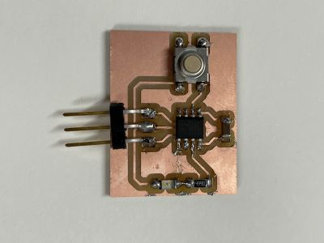       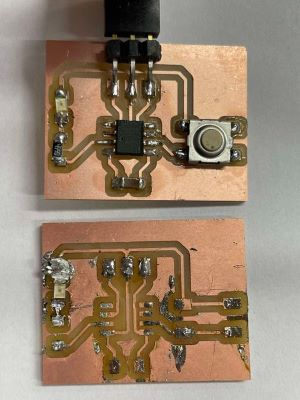 


...Well, when I thought everything was almost perfect and I checked if the LED was workin on the board, it didn´t seem to work. I decided to take it off and soulder a new one on to the board. That didn´t go well. The tin just would not stick to the plate. Then I realized that the copper film had fallen of the surface where the LED should be. I tried to use more tin to make a connection between the LED and the path it should connect to, but the tin piled up and it didn´t work. When I milled the board I made two copies, just in case I would have some problems and that was convenient now that my first board was ruined. I removed the elements from the board and souldered them to the other board and used a new LED this time. 

## How to program ATtiny412

!!!Info "Eleventh part"
  
     Finally he explaines how to program Attiny 412 [video](https://www.youtube.com/watch?v=So58u1hxy98&list=PLs4ifnZzVJmqaSM1lsg68vPVtJxVNhVwV&index=11).

To connect the board to a computer I needed a serial UPDi-3 pin, and [Svavar Konráðsson](https://www.fabisa.is/N%C3%A1msefni/Pre-Fab/2-rafrasasmidi/) told us that it was designed by [prof. Neil Gershenfeld](https://ng.cba.mit.edu/). I also needed a FTDI cord (USB to TTL Serial Cable) to make a connection from the pins on the board to USB on the computer. 

 I created a new sketch in the Arduino app. According to the pinout datasheet for ATtiny412 and the PCB board design the LED is on pin 4 and the button is on pin 0. Therefore I began by defining that the LED was on pin 4 and the button on pin 0 in Arduino by writing #define LED 4 and in the next line below #define BUTTON 0. When // is added in front of text, the computer ignores it. That way you can use text to explain what is going to happen in each step.

Here you can see how I followed the instructions from Andri (added some explanations myself) and wrote this code:

 ```

        //Defining which pin to use for LED and button
    #define LED 4
    #define BUTTON 0
    
    //Variable to keep track of how many button presses
    uint8_t buttonPresses = 0;

    //Defining what is input and what is output or input and pullup
   
    void setup() { 
        pinMode(LED, OUTPUT);
        pinMode(BUTTON, INPUT_PULLUP);
    }

    //Creating a loop that follows a pattern and then repeats itself
    void loop() { 
      //Defining what happens if button is pressed  
      if (digitalRead(BUTTON) == HIGH) {  
        //Increment buttonPresses
        buttonPresses++;

    //If buttonPresses is greater than 4, reset it to 0
    if (buttonPresses > 4) {
      buttonPresses = 0; 
    }

    // Blink LED based on buttonPresses count
    for (uint8_t i = 0; 1 <buttonPresses; i++) {
      digitalWrite(LED, HIGH);
      delay(200);
      digitalWrite(LED, LOW);
      delay(200);
    }  

    // Wait for button to be released
       while (digitalRead(BUTTON) == HIGH) {
       } 
     }  
    }

    ```


In the Arduino app I clicked on **Tools**, **Board** and then **Board manager**. Then I wrote **megatinycore** in the upper left window and chose **Install**. Then I clicked on **Tools**, **Board** and then **megaTinyCore** and then **ATtiny412**. After that I clicked on **Tools**, **Programmer** and then **SerialUPDI SLOW: 57600 baud**. 

By clicking on **Tools** and **Port** I could see a list of ports. Then I connected the cord to the computer and checked out which port had beed added to this list. That was the port that I wanted to use, so I clicked on it.

I clicked on **Sketch** and **Upload using programmer**. Everything worked except that the LED blinked constantly, as can be seen in the video below. The code was obviously not correct.


<video controls src="img/ConstantBlinking2.mp4" title="Title"></video>


Doddi advised me to change the time of the delay from 200 to 2000. That way it was easier to see how the LED was behaving. Then I took a better look at the code and saw that in one place I had written the number **1** instead of the letter **i**. I fixed that and then everything worked as it should.


The new code:

```

    //Defining which pin to use for LED and button
    #define LED 4
    #define BUTTON 0
    
    //Variable to keep track of how many button presses
    uint8_t buttonPresses = 0;

    //Defining what is input and what is output or input and pullup
   
    void setup() { 
        pinMode(LED, OUTPUT);
        pinMode(BUTTON, INPUT_PULLUP);
    }

    //Creating a loop that follows a pattern and then repeats itself
    void loop() { 
      //Defining what happens if button is pressed  
      if (digitalRead(BUTTON) == HIGH) {  
      // Increment buttonPresses
        buttonPresses++;

    //If buttonPresses is greater than 4, reset it to 0
    if (buttonPresses > 4) {
      buttonPresses = 0; 
    }

    // Blink LED based on buttonPresses count
    for (uint8_t i = 0; i < buttonPresses; i++) {
      digitalWrite(LED, HIGH);
      delay(200);
      digitalWrite(LED, LOW);
      delay(200);
  }  

    // Wait for button to be released
       while (digitalRead(BUTTON) == HIGH) {
       } 
     }  
  }

```

Finally ready and I felt happy :smile:


