#Computer aided design

##Designing a stamp handle in FreeCad

!!! example "Tutorial"

    I followed Svavar's directions on how to draw the handle. The directions can be found [here](https://www.fabisa.is/N%C3%A1msefni/Pre-Fab/5-tolvuteikning/).  

I made the drawing on the XZ-plane. I began by drawing all straight lines and using constraints to set the length, hight, width, radius and the incline degrees. Then I made the arching lines and made sure that the nodes were connected. To soften the parts where a straight line meets an arch I made the arch tangent to the line. I created a guiding line at the top and made the arch tangent with it. To create a guiding line (construction geometry) you can click on this icon. Read about it [here](https://wiki.freecad.org/Sketcher_ToggleConstruction). 

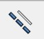

##The final sketch for the handle

This is the final sketch:

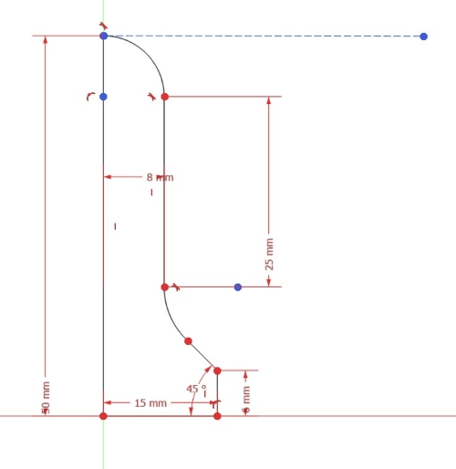

##The stamp handle drawn in 3D:

At last I chose the Revolve in Part workbench to revolve the drawing around the Y-axis to make a 3D model. Read more about revolving [here](https://wiki.freecad.org/Part_Revolve). 

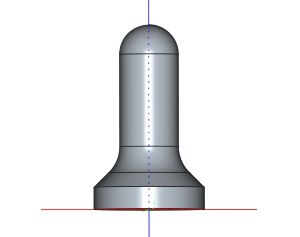

##Designing a logo

!!!Info "Designing a logo in Inkscape"
  
    This [tutorial](https://www.youtube.com/watch?v=BI8Nw69Vn5o) shows how you can make logos with custom text treatment in Inkscape.

I decided to use my first name when designing my logo. At first I used my name without the Icelandic letters, Olof instead of Ólöf. I clicked on the text icon in Inkscape and chose a font. By holding **CTRL** and **SHIFT** I could scale the size and still keep the same proportions. Then I converted the text to path by choosing **Path** and then **Object to path**. After that I clicked on **Object** and **Ungroup**. 

I clicked on **Object** and **Fill and stroke**. There I changed the **Opacity** from 100 to 50. That way the letters were a little bit transparent and I could see them all when they overlapped each other. By holding **CTRL** while moving a letter, the letter was locked on the horizontal axis when moving them around. Then I could select more than one letter by holding **SHIFT** while clicking on all letters I wanted to select when moving multiple letters at the same time.

By selecting one letter and clicking on **CTRL** and **D** I duplicated the letter. Then I changed the color of the letter by clicking on a color in the color palette at the bottom of the screen. I went to **Path** and **Path effects**. Then I clicked on the arrow to the right on the screen, below the **Path effects** text and chose **Offset**. Then I could use the **plus symbol** to increase the offset until I was happy with the size. After that I held the **Shift** button and clicked on the letter beside it. Then I chose **Path** and **Difference**. This is the outcome:

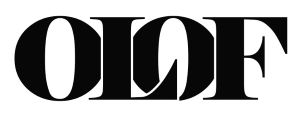

I wasn't really happy with the outcome, so I kept on trying different ways. I used the **Impact** font and arranged my name in a rectangle. 

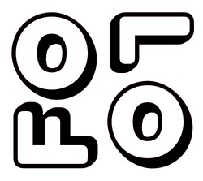     

Then I added a pink rectangle to the logo.

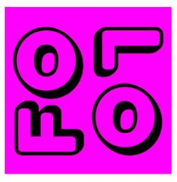

I used the **Typographica** font that I found on the website [DaFont.com](https://www.dafont.com/search.php?q=typographica), resized some letters and arranged them in a fun way to make this logo:

!!! info inline end "Inline blocks"

    This looks like an emoji! I think it would be fun to learn how to use **Blender** to change this logo to an emoji. I could call it **Baffled face**, expressing the feeling that can come over people when learning something new in Fab Academy. 

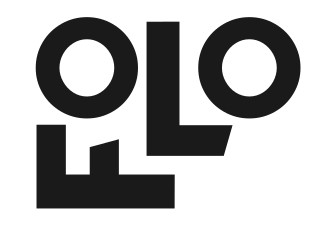      

Then I tested how it would look with the **ComicSans** font:

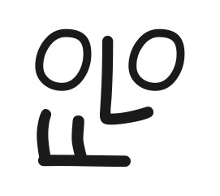 

##The final design

I found the **Pricedown** font on [DaFont.com](https://www.dafont.com/search.php?q=pricedown), stretched some lines and created an outline.
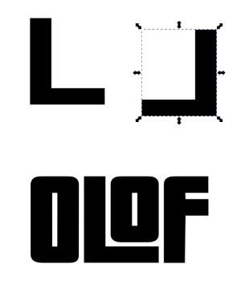

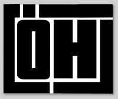

I made two versions of the final logo, with and without the Icelandic letters.

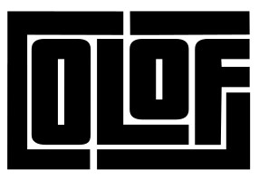

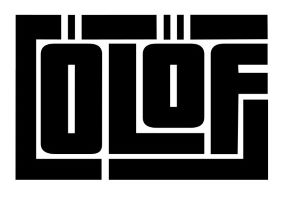

##Problems with settings for logo and favicon

I ran into some problems when I tried to use the logo on the website. The logo didn't appear when I followed what [Svavar](https://fabacademy.org/2023/labs/isafjordur/students/svavar-konradsson/assignments/week01.html#customizing-the-theme) had done. Then I tried to follow the instructions on this [site](https://squidfunk.github.io/mkdocs-material/setup/changing-the-logo-and-icons/), but it didn't work either. I checked if there was any difference in using *.jpg, *.png or *.svg and I also checked if they would work in the image folder or just under docs in the repository. When none of this worked, I asked [Þórarinn Bjartur Breiðfjörð](https://fabacademy.org/archives/2015/eu/students/gunnarsson.thorarinn_b.b/index.html). After looking into what I had done he suggested that I would not write the folder name before the name of the file and it worked. I do not know why this worked better, but I was glad that it did.

