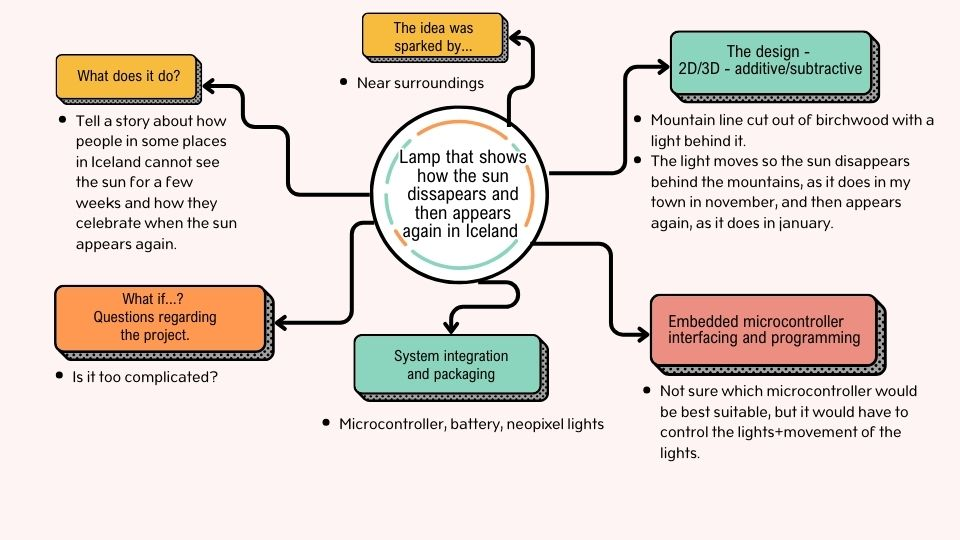

#Final project

##The search for an idea

In the beginning I had so many starting points to choose from but it was quite difficult to see how they would look as a final project. These were the first ideas that interested me:

* Something that acts as a living being:
    - A plant that raises her leaves in daylight and loweres them at night.
    - An animal form that rises up at certain time and kneels after some time.
    - An animal that swims/moves in slow movements (Greenland shark?)

* A lamp or a wall light that shows how the sun disappears in my town for a few weeks. The mountain cut out of birch plywood and the light situated behind the mountains, shining between the mountaintops and finally over the mountain. I picturize it as covering a whole wall in a small room, maybe in a hallway, where you could sit and watch the light appearing on the opposite wall. The height of the mountains would be around 180 centimeters, but maybe this would be a little bit too big as a project and I do not know where it could be situated.

If this was only a small lamp, I´m not sure if I could fit the embedded microcontroller, battery, neopixel lights, the axis and motor neatly in packaging behind the mountain shaped front. I wonder if I could use Sparkfun ESP32, a DMX and LEDs similar to those that are used in this [video](https://learn.sparkfun.com/tutorials/sparkfun-esp32-dmx-to-led-shield/all). I would like my LEDs to move up and down an axis, maybe with a white, matte plexiglass cirkle in front of them. Then the cirkle would appear like the sun over the mountains. The front of the lamp would be cut out of birch plywood and the rocks and the canyons would be rasterized.

* A light hanging from the ceiling with lights that can be controlled.
    - Laser cut forms.
