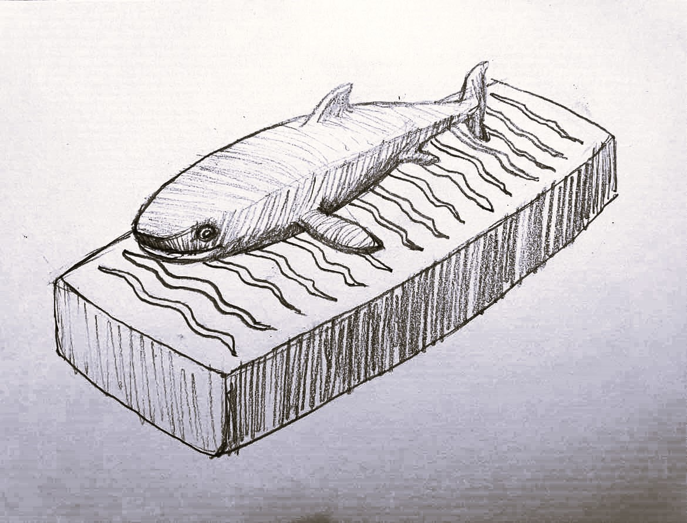

#Final project

##The search for an idea

In the beginning I had so many starting points to choose from but it was quite difficult to see how they would look as a final project. These were the first ideas that interested me:

###The Sun

I live in a town where tall mountains surround a small fjord. When the sun is low on the horizon it disappears behind the mountains for a few weeks. This happens in many places in Iceland. The daylight can still be bright, but it´s always good to see the sun again in january and people celebrate. The idea is to tell this story by creating a wall light that shows how the sun disappears and then appears again.

The mountain would be cut out of birch plywood and the light would be situated behind the mountains, shining between the mountaintops and finally over the mountain. I picturize it as covering a whole wall in a small room, maybe in a hallway, where you could sit and watch the light appearing on the opposite wall. The height of the mountains would be around 180 centimeters, but maybe this would be a little bit too big as a project and I do not know where it could be situated. Maybe I would have to ask my friends and family if they would like to have a wall like this in their home.

The other possibility is to make this a small lamp. I would fit the embedded microcontroller, battery, neopixel lights, the axis and motor neatly in packaging behind the mountain shaped front. I wonder if I could use Sparkfun ESP32, a DMX and LEDs similar to those that are used in this [video](https://learn.sparkfun.com/tutorials/sparkfun-esp32-dmx-to-led-shield/all). I would like my LEDs to move up and down an axis, maybe with a white, matte plexiglass cirkle in front of them. Then the cirkle would appear like the sun over the mountains. The front of the lamp would be cut out of birch plywood and the rocks and the canyons would be rasterized.

###Mindmaps for Sun Wall and Sun Lamp

###The Greenland Shark

* I wanted to do something that acts as a living being og gives you that sense, f.ex.:
    - A plant that raises her leaves in daylight and loweres them at night.
    - An animal form that rises up at certain time and kneels after some time.
    - An animal that swims/moves in slow movements (Greenland shark?)

Then I saw the final project called Cloudio in Fab Academy by [Wim Lance](https://archive.fabacademy.org/archives/2017/fablabbcn/students/4/?fbclid=IwY2xjawGtV-xleHRuA2FlbQIxMAABHf_CMNKYg_JXdylS7TvDwCbYmvoqZ3rK_b5B2yk4m1mZU0VTOpcq3RT0cg_aem_BLl3n2J2xJ3GL85Ako3vgA) and I liked the idea about levitation very much. I wondered if I could do something similar with my Greenland shark idea. I would like to see it floating calmly in the air, just as it floats slowly around in the cold sea. Maybe it would be possible to lasercut wavelike lines in the box/base and let Neopixel lights move and shine out of the box, casting ripples onto the walls or ceiling as if it was a reflection from the sea.

I would do a 3D design and print the shark. The box would be cut out of birch plywood and all elements, microcomputer, battery, solenoid coils?, magnetic wave sensor? packaged in the box. The shark would include ......This is an incomplete list and [Svavar Konráðsson](https://fabacademy.org/2023/labs/isafjordur/students/svavar-konradsson/index.html) pointed out that I have to decide what kind of input I would like to use. The same goes for the Sun wall and the Sun lamp idea.

###Mindmap for Greenland shark

###A hanging light

* A light hanging from the ceiling with lights that can be controlled.
    - Laser cut forms.

