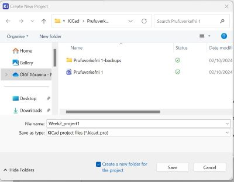
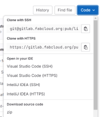
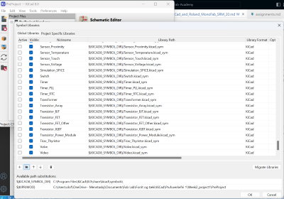
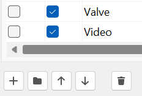
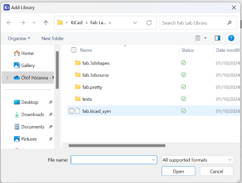
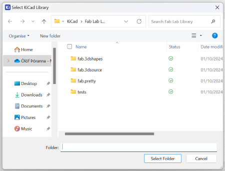

**KiCad and Roland MonoFab SRM-20**

[Andri Sæmundsson](https://fabacademy.org/2023/labs/akureyri/students/andri-semundsson/pages/aboutMe.html) made [videos](https://www.youtube.com/watch?v=iOPbk1W3X5k&list=PLs4ifnZzVJmqaSM1lsg68vPVtJxVNhVwV&index=1)  for Fab Lab Reykjavík where he explains how to set up KiCad 8. 

On [KiCad.org](hhttps://www.kicad.org/download/windows/) I downloaded the KiCad program and then installed it on the computer. On the [About KiCad](https://www.kicad.org/about/kicad/) site it says that KiCad is an open source software that can be used to design EDA or Electronic Design Automation. In [KiCad](https://www.kicad.org/) Schematic Editor is used to draw electronic circuit and you have access to thousands of symbols that can be found in libraries. The PCB Editor is then used to add elements (???) to the circuit. Then you can use the 3D viewer to preview your design. 

I opened the program, clicked on **File** and **new** to create a new project. I saved it in a folder in my computer. Then I could see that under my new program I could see both the Schematic file and the PCB file. I began by editing the Schematic file.

In this [video](https://www.youtube.com/watch?v=ZeAAy6L8AB8&list=PLs4ifnZzVJmqaSM1lsg68vPVtJxVNhVwV&index=2) he explains how to hide librarys that are seldom used and add a KiCad library. After watching the video I googled "Fab Lab library", as suggested in the video, and downloaded [this library](https://gitlab.fabcloud.org/pub/libraries/electronics/kicad). Then I clicked on the button marked as **Code** and chose **Zip**. Then I opened up the downloads folder and extracted the library. I saved this library in a folder where I plan on storing everything connected to working with KiCad.

The next step was to open KiCad, click on **Preferences" and **Manage Libraries**. This photo shows that there are many libraries and it can be hard to find the right library, so as [Andri Sæmundsson](https://fabacademy.org/2023/labs/akureyri/students/andri-semundsson/pages/aboutMe.html) mentioned in the video, it would be easier to work with a few libraries, but first I had to install the Fab Lab library before removing other libraries.

I clicked on the small button with a folder sign on it, opened up the folder with the library and double clicked on the **sym** file.

Then I clicked on **Preferences** and chose **Footprint Libraries**. I clicked on the **Folder** button and this time I added the Fab.Pretty folder.

In these three videos; [first part](https://www.youtube.com/watch?v=ZXyL5xjJb7w&list=PLs4ifnZzVJmqaSM1lsg68vPVtJxVNhVwV&index=3), [second part](https://www.youtube.com/watch?v=knyDOiUZNsc&list=PLs4ifnZzVJmqaSM1lsg68vPVtJxVNhVwV&index=4), [third part](https://www.youtube.com/watch?v=dM3h--A04W4&list=PLs4ifnZzVJmqaSM1lsg68vPVtJxVNhVwV&index=5) he explains how to use Scematic editor.

This [video](https://www.youtube.com/watch?v=2oxuvwRuQNM&list=PLs4ifnZzVJmqaSM1lsg68vPVtJxVNhVwV&index=6) explains how to use the PCB editor.

In this [video](https://www.youtube.com/watch?v=ZeAAy6L8AB8&list=PLs4ifnZzVJmqaSM1lsg68vPVtJxVNhVwV&index=2) he adds 3D model to his PCB and uses the 3D viewer.

 [Here](https://www.youtube.com/watch?v=Tq6v1HqWmm0&list=PLs4ifnZzVJmqaSM1lsg68vPVtJxVNhVwV&index=8) he shows how to use Design Rule Checker and Inkscape.

In this [video](https://www.youtube.com/watch?v=zJNpHpuvNjk&list=PLs4ifnZzVJmqaSM1lsg68vPVtJxVNhVwV&index=9) he explaines how to mill a board with Fab Modules.

Souldering on a board is explained [here](https://www.youtube.com/watch?v=3f6FUTbL8kg&list=PLs4ifnZzVJmqaSM1lsg68vPVtJxVNhVwV&index=10).

And finally he explaines how to program Attiny 412 [video](hhttps://www.youtube.com/watch?v=So58u1hxy98&list=PLs4ifnZzVJmqaSM1lsg68vPVtJxVNhVwV&index=119).

