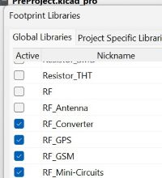

**KiCad and Roland MonoFab SRM-20**

[Andri Sæmundsson](https://fabacademy.org/2023/labs/akureyri/students/andri-semundsson/pages/aboutMe.html) made a series of videos for Fab Lab Reykjavík, where he explaines all the steps in using KiCad, Inkscape, Fab Modules and a milling machine to produce an electric circuit board. I followed his directions and here I describe every step I took.

In the first [video](https://www.youtube.com/watch?v=iOPbk1W3X5k&list=PLs4ifnZzVJmqaSM1lsg68vPVtJxVNhVwV&index=1) he explains how to set up KiCad 8. On [KiCad.org](hhttps://www.kicad.org/download/windows/) I downloaded the KiCad program and then installed it on the computer. On the [About KiCad](https://www.kicad.org/about/kicad/) site it says that KiCad is an open source software that can be used to design EDA or Electronic Design Automation. In [KiCad](https://www.kicad.org/) Schematic Editor is used to draw electronic circuit and you have access to thousands of symbols that can be found in libraries. The PCB Editor is then used to add elements (???) to the circuit. Then you can use the 3D viewer to preview your design. 

I opened the program, clicked on **File** and **new** to create a new project. I saved it in a folder in my computer. Then I could see that under my new program I could see both the Schematic file and the PCB file. I began by editing the Schematic file.

In this [video](https://www.youtube.com/watch?v=ZeAAy6L8AB8&list=PLs4ifnZzVJmqaSM1lsg68vPVtJxVNhVwV&index=2) he explains how to hide librarys that are seldom used and add a KiCad library. After watching the video I googled "Fab Lab library", as suggested in the video, and downloaded [this library](https://gitlab.fabcloud.org/pub/libraries/electronics/kicad). Then I clicked on the button marked as **Code** and chose **Zip**. Then I opened up the downloads folder and extracted the library. I saved this library in a folder where I plan on storing everything connected to working with KiCad.

The next step was to open KiCad, click on **Preferences" and **Manage Libraries**. This photo shows that there are many libraries and it can be hard to find the right library, so as [Andri Sæmundsson](https://fabacademy.org/2023/labs/akureyri/students/andri-semundsson/pages/aboutMe.html) mentioned in the video, it would be easier to work with a few libraries, but first I had to install the Fab Lab library before removing other libraries.

I clicked on the small button with a folder sign on it, opened up the folder with the library and double clicked on the **sym** file.

Then I clicked on **Preferences** and chose **Footprint Libraries**. I clicked on the **Folder** button and this time I added the Fab.Pretty folder.

After adding the Fab Lab library to the lists of libraries I took the clicks away from the box under **Active** in front of every other library. After that the only active library is the Fab Lab library.

In these three videos; [first part](https://www.youtube.com/watch?v=ZXyL5xjJb7w&list=PLs4ifnZzVJmqaSM1lsg68vPVtJxVNhVwV&index=3), [second part](https://www.youtube.com/watch?v=knyDOiUZNsc&list=PLs4ifnZzVJmqaSM1lsg68vPVtJxVNhVwV&index=4), [third part](https://www.youtube.com/watch?v=dM3h--A04W4&list=PLs4ifnZzVJmqaSM1lsg68vPVtJxVNhVwV&index=5) he explains how to use Scematic editor.

In Schematic Editor I opened the Fab Lab library by clicking on this symbol.

I wrote ATtiny 412, chose it from the list and clicked **ok**. I could drag it around and I placed it on the screen by leftclicking on the screen. To add a switch I opened the library again and wrote "Switch

SMT means that the button should be surface mounted.

The next step was to add a button, so I opened the library again and wrote **button**. From the list I chose Switch_Tactile_Omron.

After that I added a capacitor with the number **C_1206**. The number tells the size of the capacitor....

Then I added a Led with the same number as the capacitor; **L_1206**. 

The last element that I added was a Conn_PinHeader with three male pins in a row.

Because the icon for the library is chosen, each time I click on the screen the library opens. To be able to use the mouse I had to click on the arrow at the top of the list. Then I could use the mouse to move elements around. 

To rotate an element you can write "R" and then the element rotates 90 degrees.

Elements can be labeled by clicking on the symbol marked with an underlined A or just writing the letter"L". I added a label marked GND to Ground and another one marked VCC to VCC. I labelled pin 6 as UPDI.. I labelled pin 7 as LED and also put a LED label on the resistor. Then I connected the other end of the resistor to the LED with wire.I labelled the other end of the LED with GND. 

I labelled one end of the capacitor with GND and the other end with VCC. I labelled one end of the switch as GND and the other one as BNT.

The first pin on the PinHeader I labelled as VCC and the second one as GND. Pin nr. 3 was labelled as UPDI.

 I connected the led to pin 7, which is marked as PA3. Then I connected the LED to Ground. Then I connected the swithc to pin 2, which is marked as PA6. In Schematic Editor it looks as if Pins nr. 2 and 7 are on the same side but when you look at this photo of ATtiny 412 from [Spence Konde](https://github.com/SpenceKonde/megaTinyCore/raw/master/megaavr/extras/ATtiny_x12.gif) you can see that the pins are on each side.

I connected the first pin on the Conn_PinHeader to Ground, the second one to VCC and the third one to UPDI. 

I used the **Electrical Rule Checker** to see if everything was legal but got a few errors. After marking pins nr. 3, 4 and 5 with **No connection flag** and putting a **power flag** on **Ground** and **VCC*, the Electrical Rule Checker everything seemed to be okay.

In Page settings I changed the page size to A5 and added some information about the project. Then I added a text box, just to try it. I also put a rectangular frame around some of the elements and changed the style of the frame.

This [video](https://www.youtube.com/watch?v=2oxuvwRuQNM&list=PLs4ifnZzVJmqaSM1lsg68vPVtJxVNhVwV&index=6) explains how to use the PCB editor.

Before opening the PCB editor I changed the value of the capacitor and the resistor by clicking on each of these element and then clicking on the symbol for Properties. Another way to open the Properties manager is to right click on an element and choose the Properties manager from the list. The third way is simply to write the letter E and the fourth way is to double click on the text.
 I changed the value of the Capacitor from C_1206 to 1 uF, the value of the Resistor from R-1206 to 1k. Then I opened the PCB Editor by clicking on the symbol for it in the top bar.

 To fetch the elements from the Schematic Editor I clicked on **Update PCB Editor from Schematic**. Then a window popped up and I clicked on the Update PCB button.

 In the PCB Editor you can see different layers at the right side of the window, choose those layers you want to work with and hide all others. I was working with the top layer of the electric board and therefore I chose the F.Cu, or in other words; the front of the copper plate. Then I could hide the view of the backside by clicking on the **eye** in front of B.Cu.
 I hid all layers except the layers for F.Silkscreen, Edge.Cuts, F.Courtyard and .... The F.Courtyard shows a violet frame around elements and it shows how close you can lay wires to elements, f.ex. if you cross the violet frame you are too close to an element. 

I changed the setup of the pins by editing the labels in Schematic Editor; Pin1 changed from VCC to UPDI and Pin3 changed from UPDI to VCC. Then I clicked on **Update PCB Editor from Schematic**.

I could see that some of the blue lines, which showed how the electric circuits would be connected, were crossed. To fix that I by rotating elements.

When organizing the board I had to make sure that I wouldn´t make the RAFRÁSIRNAR too thin and that there is enough space for the bit to mill the traces while making sure that there is enough clearance.
In **Board Setup** I went to **Design rules** and wrote that mininum clearance, minimum track width, minimum connection width, minimum annular width and copper to hole clearance should all be 0.4mm.

To connect the elements/making tracks for the circuits that I wanted to mill, I clicked on the **Route Tracks** symbol and began drawing tracks between footprints. I made sure that the lines were straight when entering footprints. I used the Route tracker to mark all circuits that had to be milled, as can be seen in this photo. 

To see what the board would look like I clicked to the 3D viewer and saw that Kicad made no extra space around the circuit, so I chose the Edge.Cut layer, clicked on the rectangular symbol and drew a rectangle around the circuit, giving it more space around all elements. This is what it looked like in 3D view after that.

In this [video](https://www.youtube.com/watch?v=ZeAAy6L8AB8&list=PLs4ifnZzVJmqaSM1lsg68vPVtJxVNhVwV&index=2) he adds 3D model to his PCB and uses the 3D viewer. To add 3D models to my board I right clicked on each element, chose **properties** and then clicked on **3D models** in the top bar. Then I had to click on the line that was lighted up with blue because then a small folder logo appeared beside the text. After that I clicked on this **small folder symbol**, searched for the **Fab Lab Library** and opened it. In it I found the **Fab.3Dshapes** folder and opened it to find **R_1206.step** and finally click on **OK**. When I opened up the 3D viewer I could see that the Resistor appeared in 3D on the board.

There was no 3D model for ATtiny4012, led light and button in Fab.3Dshapes, so [Andri Sæmundsson](https://fabacademy.org/2023/labs/akureyri/students/andri-semundsson/pages/aboutMe.html) explained in the video what to do and pointed to this [website](https://www.snapeda.com/) to find the 3D model. I had to sign up to be able to use the website. Then I used the search window to find each element, chose the right one from a list and downloaded a 3D model. I opened the download in the downloads folder, copied it and pasted it into the **Fab.3Dshapes** folder. After that I could find the models in the same way as I explained before. The only problem was that when these models were opened up in Kicad-properties-3D models-Fab.3Dshapes they didn´t sit on the plate but lay on their side. That was easily fixed just by rotating them about 90 degrees.

 [Here](https://www.youtube.com/watch?v=Tq6v1HqWmm0&list=PLs4ifnZzVJmqaSM1lsg68vPVtJxVNhVwV&index=8) he shows how to use Design Rule Checker and Inkscape. [Andri Sæmundsson](https://fabacademy.org/2023/labs/akureyri/students/andri-semundsson/pages/aboutMe.html) shows how to use **Design Rule Checker** to see if everything is legal. I clicked on the symbol for it and chose **Run DRC**. I got 6 warnings that said "Silkscreen clipped by solder mask". Andri said that it would be important to fix this if the board was to be produced, but since this doesn´t really matter when this board is made, i ignored the warnings. 

 To export the final desing I chose **File** and **Export SVG**. I checked in the **F.Cu box** and changed the **Print Mode** from color to **black and white**. Then I saved the file. The next step was to open the file in Inkscape. The whole page appeared in Inkscape with the frame around the page and the text boxes. I only needed the board, so I copied it and pasted it into a new Inkscape file. In Inkscape I changed the colour of the circuit from black to white and changed the background to black. 

In this [video](https://www.youtube.com/watch?v=zJNpHpuvNjk&list=PLs4ifnZzVJmqaSM1lsg68vPVtJxVNhVwV&index=9) he explaines how to mill a board with Fab Modules.

Souldering on a board is explained [here](https://www.youtube.com/watch?v=3f6FUTbL8kg&list=PLs4ifnZzVJmqaSM1lsg68vPVtJxVNhVwV&index=10).

And finally he explaines how to program Attiny 412 [video](hhttps://www.youtube.com/watch?v=So58u1hxy98&list=PLs4ifnZzVJmqaSM1lsg68vPVtJxVNhVwV&index=119).

