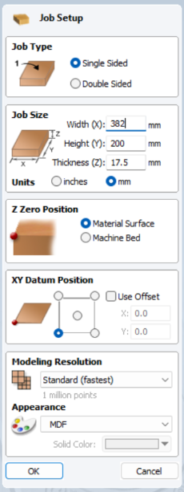
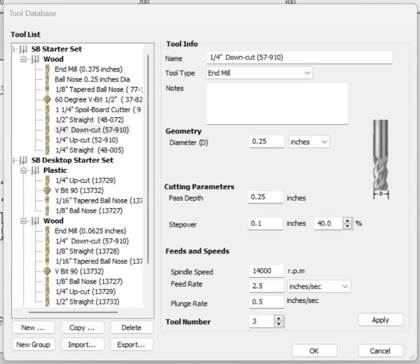
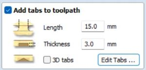
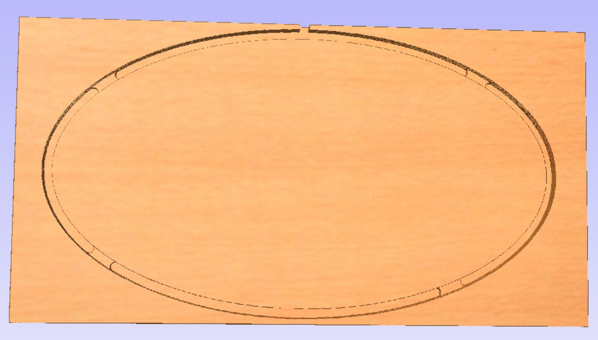
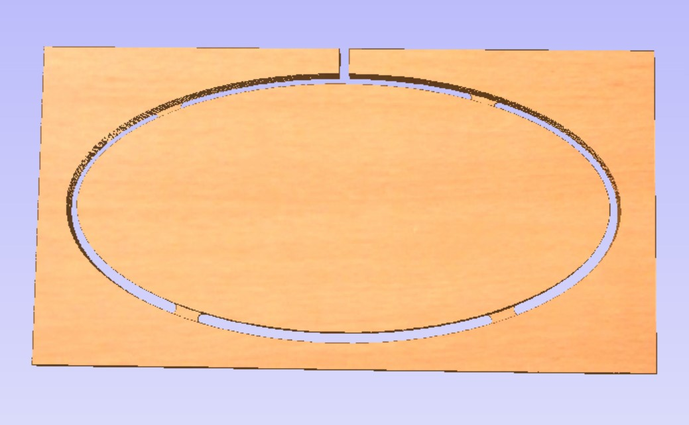

#Using the ShopBot

##About the ShopBot

In the video it is explained that CNC stands for Computer Numerical Control and that the speed is measured in inches per second (ips).

2.5D is usually used when making signs, so I would compare it to making a relief. Router travels by x and y axis and only uses the z-axis to go in and out of toolpaths. To do a 3D work you would have to design a 3D model. 

##Designing the sign

I used the program [VCarve pro](https://www.markdownguide.org/basic-syntax/) to design my sign. 

I began by filling in the size of the material I wanted to use. I wrote 382mm x 200mm. It is very important to always measure the thickness of the material because it can vary. I set the thickness to 17.5mm.

!!! Job setup"

    I began by filling in the size of the material I wanted to use. I wrote 382mm x 200mm. It is very important to always measure the thickness of the material because it can vary. I set the thickness to 17.5mm. 

I tested how to draw a perfect rectangle by choosing the rectangle and holding the **Control** button when clicking and drawing with the mouse. I deleted it and drew an ellipse. Then I wrote a text by clicking on the big T. When the text was on the plate I resized it by using the resizing arrow, clicked on the text and dragged one corner to make it smaller. By holding the **Shift** key whilst doing that it centered and rezised it all.

To use a ruler as a measurement guide I chose the normal arrow (for the mouse), left-clicked on the ruler and held it down as I dragged it to where I wanted to have a guide line. 

By pressing fn and F12 the toolpath settings open up and by pressing fn and F11 these settings are closed and the drawing tab appears again. In 

I double clicked on the icon near **material setup** and adjusted the following:
I **set the xy origin position to bottom left** and made sure that **Use origin offset was NOT chosen**. I **set the z origin to the top of the material.**

Under **Rapid Z gaps above material** I clicked **Above material** and set **Clearance Z1** and  **Plunge Z2** to 5mm. In the video this was set to 0.5 inhces, which equals 12.7mm, but a co-teacher of mine said that it would be okay to set it to 5mm since the material I was using was even. 

Home/start position was set to: x=0, y=0 and z=20 (mm). **The z should never be set to 0.**
Then I clicked on **ok**.

The next step was to click on the outline and then select **Profile toolpath**. The **start depth** should always (usually) be set to 0. I wanted to cut the material in two passes, so the cutting depth should be around just over half of the thickness of the material in each pass. So I set the cutting depth to 9mm.

##Selecting the right tool

Under **Tool** I clicked on **Select** and chose the 0.25 inch downcut endmill. My co-teacher told me that I should keep the cutting depth within the diameter of the tool. Spindle speed should not be changed. In the video it is recommended that the feed rate (speed) should be between 2 and 3 inches per second, to be safe. 

I chose **Machine vectors** to be outside. Then I added **Tabs**. 
Below the Tabs option there were a few settings and I chose the **Leads** option and checked in the box by **Add leads**. By activating it, there will be a nicer cut where the tool is going to plunge in because it begins the plunge just a little bit outside of the path and goes smoothly down in a tiny curve. Next to the **Leads** option there is another option called **Ramps**. I checked in **Add ramps to toolpath**. It is similar to **Leads** but works in the Y direction. Both **Ramps** and **Leads** work well whith the preset settings. 

Finally, I clicked on **Calculate**, gave the path a name and saved it. To preview it i had to click on the name and then choose **Preview the selected toolpath**. When I previewed it I realized that I had made a mistake. It did not cut through because I wrote the wrong size in **Cut depth**. 

I reset (cleared) the preview and opened the drawing again, because I decided to make the ellipse/outline smaller. Then I put tabs on again and increased the cut depth, so that it was 18mm. The material was 17.5mm so I added 0.5mm to the cutting depth. Then I calculated and previewed it again and everything looked ok.

The next step was to select the vectors in the inlay and click on **Quick ingrave toolpath**, which is a toolpath that creates depth and makes the sign become a relief. When I planned on choosing the same V-bit as in the video, I could not find the same size for 60 degrees. The same thing happened when I followed the directions on how to use the VCarve settings, so I chose a 1/2" 60 degree V-bit and set the depth to 1mm before calculating.

##Prepairing the ShopBot

In the video it says that it´s a good idea to reset the machine between jobs just by switching the red switch on and off. Then I fastened the material in four corners with screws. I moved the spindle over the material and then pressed **Escape** to leave the manual

Under **Cuts** I selected **Zero z axis to zero plate**. Then I placed a metal plate, that is fastened to the machine, under the bit. The machine lowered it´s until the bit touched the plate. When they touched, a circuit let the machine know and the zero point was set. Then I returned the metal plate to the slot, where it is always kept. After that I set x and y to zero manually. When the router bit was over the right spot, I pressed **Escape** and set this point to zero by clicking on **Zero** and then **Zero to x and y**. Then I chose **Jog** and **Jog home**. 

##Performing the cut

I clicked on **Cut file** .............. and open the right file. Then a window popped up and I pressed **Enter**. Important: Never change any settings in this window!

