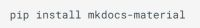
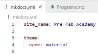
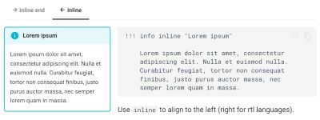

I had a lot to learn and many steps to go through when creating this website. Even though [Svavar Konráðsson](https://fabacademy.org/2023/labs/isafjordur/students/svavar-konradsson/index.html) and [Þórarinn Bjartur Breiðfjörð](https://fabacademy.org/archives/2015/eu/students/gunnarsson.thorarinn_b.b/index.html) guided me through the whole process, it was a lot to learn. I ran into quite a few problems but in the end all worked out. 

##Prior knowledge

A few years back I created a simple website using a template from [Wix](https://www.wix.com/). Then, a few months ago, I participated in adding information to a website made by [Þórarinn Bjartur Breiðfjörð](https://fabacademy.org/archives/2015/eu/students/gunnarsson.thorarinn_b.b/index.html) and [Svavar Konráðsson](https://fabacademy.org/2023/labs/isafjordur/students/svavar-konradsson/index.html). I did this by using GitHub web editor, so I had gotten to know editing Markdown a little bit. This helped me a lot.

##Compressing photos and videos   

In the beginning of my documentation I used the Snipping Tool. Since the size of all images was around 15-50kb I thought that they would be conveniently small for my website, and I decided to load them all up at the same time. When I checked out the website I saw that they were too big. I opened each of these photos in the **Photos** program, clicked on the three points at the top and chose **Resize image**. This way I could adjust the quality of the image and also the width and height in pixels. Each time I saved a copy of a resized photo I added the pixel size to the name of the photo. The widht in pixels determined how wide the photo would appear on the screen, so I like using this way of resizing photos. 
  
[Svavar](https://fabacademy.org/2023/labs/isafjordur/students/svavar-konradsson/index.html) introduced me to another way of compressing photos, which is using the **Greenshot** program. He also explained how to use **"FFMPEG** to compress videos. He explaines all of this in icelandic in this [video](https://www.youtube.com/watch?v=hpqzA3OpYOs&t=30s). I copied the commands from [Svavar´s website](https://fabacademy.org/2023/labs/isafjordur/students/svavar-konradsson/assignments/week01.html#final-project-sketch) and followed a link on his website to this [site](https://www.w3schools.com/tags/tag_textarea.asp) to learn how to make a textbox. I copied the code and adjusted it, as you can see here below:

!!! example "Greenshot"

    With Greenshot you can take screenshots to document everything. You can download it [here](https://getgreenshot.org/).  


<label for="ImageMagick">ImageMagick Command for compressing photos:</label>

<textarea id="ImageMagick" name="ImageMagick" rows="4" cols="50">
magick input_image.png -resize 1000 -quality 80 output_image.jpg
</textarea>


!!! example "FFMPEG"

    You can use FFMPEG to compress videos. That is very helpful since videos tend to be very large files. You can download it [here](https://ffmpeg.org/download.html).  


<label for="FFMPEG">FFMPEG Command for compressing videos:</label>

<textarea id="FFMPEG" name="ImageMagick" rows="4" cols="50">
ffmpeg -i input_video.mov -vcodec libx264 -crf 25 -preset veryslow -movflags +faststart -vf scale=-2:360 -c:a aac -b:a 128k output_video.mp4
</textarea>

!!! Success "How to use these commands to compress photos or videos"

    The text in the text boxes can be edited, then copied and finally pasted in the adress bar at the top of our folder - but first you have to write **cmd** in the adress bar and hit enter. After that, you can paste the command there.


!!! Failure "Not as easy as it seemed"

    This sounded easy and I wanted to follow these instructions on how to use FFmpeg to resize a video, but it didn´t work at all. The computer said that it didn´t recognize the FFmpeg as an internal or external command, operable program or batch file. [Árni Björnsson](https://fabacademy.org/2022/labs/isafjordur/students/arni-bjornsson/) sent me two links to help me understand how to solve this problem and set FFmpeg up the right way. The first link explaines what external variables are and how to edit them, see [here](https://www.howtogeek.com/787217/how-to-edit-environment-variables-on-windows-10-or-11/). The second link is a guide to how FFmpeg is set up, see [here](https://windowsloop.com/install-ffmpeg-windows-10/). I had to ask a collegue of mine, Viðar Guðmundsson, to assist me. He is an administrator at my scool. He followed the instructions on this [site](https://phoenixnap.com/kb/ffmpeg-windows) to put FFmpeg to path.


##Setting up programs

To prepare the creation of this website and documentation of the assignments it was necessary to install a few programs:


!!! note "Python"

    On Python´s [website](https://www.python.org/about/gettingstarted/) Python is explained as a language for programming that works fast and is effective in integrating systems. There you can find directions for beginners.


!!! note "GitHub"

    In this [video](https://www.youtube.com/watch?v=pBy1zgt0XPc) GitHub is explained in a fun way. You can use GitHub to code and store data, both on your own or in collaboration with others. I had signed up in GitHub a few months ago so I had an account but when I installed Visual Studio Code I had to connect VSC to my GitHub account. The link to GitHub is [here](https://github.com/)


!!! note "Visual Studio Code"

    According to their website, in VS Code you can code in different programming languages, f.ex. HTML, Python, Json, Javascript, YAML and create Markdown and that is exactly what I needed to do when creating my website. One more thing; it is necessary to close VS Code after installing programs or adding extensions and then open it again to begin working. [Information here](https://code.visualstudio.com/). 

!!! note "GitHub Graph"

    GitHub Graph can be used as an extension in Visual Studio Code. When you click on it you can see all commits in a pictorial tree/timeline. You can travel between changes in files and restore old commits if necessesary. I like the picturesque look of all the actions because it helps getting a good overview of what has been done. [See here](https://marketplace.visualstudio.com/items?itemName=mhutchie.git-graph).  


!!! note "Material for MkDocs"

    Material for MkDocs is a site generator that can build HTML sites and it works well with GitHub and Visual Studio Code. You can choose between different themes and add plugins. I like the clear instructions that can be found on their [website](https://www.mkdocs.org/).  


##Understanding HTML+Javascript

The first assignment was to copy a code from [here](https://www.w3schools.com/html/default.asp) and paste it into a NotePad. By saving the NotePad file as a HTML file it opens up as a webpage when doubleclicked on. This helped me to understand how HTML and Javascript work.


##Learning about CSS

The next step was to learn about CSS, or Cascade Style Sheet, and how we can use CSS to control the way our HTML code appears, f.ex. the colour of elements, where text is situated and which fonts to use. On this page [here](https://www.w3schools.com/css/css_intro.asp) we could find explanations on CSS.


##Learning about Basic syntax/Markdown

By reading about what to do and what not to do on [here](https://www.markdownguide.org/basic-syntax/) it helps when writing a Markdown. I took another look at this page after some coding and realized that I was not doing everything the right way. I should have put a blank line before writing a heading, instead of writing the heading at the top of the terminal. I also should have pressed the space button between the hashtag symbol and the text in the heading, instead of not leaving space inbetween.


##Cloning a repository

In VS Code I cloned the repository from my GitHub account. Then I clicked on the three points in the top bar, chose **Terminal** and then to **Open a new terminal**. 


##Material for docs

To set up Material for docs I installed a Python package by copying and pasting this code:<pip install mkdocs-material> from this [website](https://squidfunk.github.io/mkdocs-material/getting-started//) into the terminal.  



I saw that [Svavar Konráðsson](https://fabacademy.org/2023/labs/isafjordur/students/svavar-konradsson/index.html) added Admonition and SuperFences to be able to add notes, codeblocks and more to his website. I decided to do the same and add admonition to my mkdoks.yml file from [here](https://squidfunk.github.io/mkdocs-material/reference/admonitions/). Below is the code that I copied:

``` 
markdown_extensions:
  - admonition
  - pymdownx.details
  - pymdownx.superfences
```

But I also saw that [Svavar](https://fabacademy.org/2023/labs/isafjordur/students/svavar-konradsson/index.html) had more markdown extensions on his list, so I followed what he had done and added these:

``` 
  - pymdownx.highlight:
      anchor_linenums: true
  - pymdownx.inlinehilite:
  - pymdownx.snippets
```


I also copied codes from the same site [here](https://squidfunk.github.io/mkdocs-material/reference/admonitions/) and adjusted the text to fit here on my page. The look and usage of admonitions can vary and you can learn more about it here:

!!!Info
  
    Have fun changing admonitions by reading about them [here](https://squidfunk.github.io/mkdocs-material/reference/admonitions/)


##Collapsable block

??? note "Toggle the arrow here on the right side"

    I think it´s absolutely brilliant to be able to make a collapsable block, like this one, with a small toggle to the right.


##Inline block

!!! info inline end "Inline blocks"

    It is important to place content after the code for inline blocks. The photo here on the left side is a screenshot from [here](https://squidfunk.github.io/mkdocs-material/reference/admonitions/), and so is the code that was used to make this Inline block. 



!!! note

    The photo is 400 pixels wide, 500 pixels was to wide so that the inline box did not fit beside the photo.

##Icons and emojis :smile: 

An icon or an emoji can say so much and I found information about how to set them up [here](https://squidfunk.github.io/mkdocs-material/reference/icons-emojis/). I copied this code to enable the use of icons and emojis and pasted it into my mkdocs.yml:

``` 
  - attr_list
  - pymdownx.emoji:
      emoji_index: !!python/name:material.extensions.emoji.twemoji
      emoji_generator: !!python/name:material.extensions.emoji.to_svg
```

##Adjusting colors on the page

The colors on the page can be adjusted as explained [here](https://squidfunk.github.io/mkdocs-material/setup/changing-the-colors/). 


!!!Info
  
  
    I like being able to format text, f.ex. to higlight or underline words and to write keyboard keys, as described [here](https://squidfunk.github.io/mkdocs-material/reference/formatting/#highlighting-text), so I copied the code below and added it to mkdocs.yml:


``` 
  - pymdownx.critic
  - pymdownx.caret
  - pymdownx.keys
  - pymdownx.mark
  - pymdownx.tilde
```

##Mistakes

One of the mistakes I made when creating this site was to make two yaml files in my Actions folder. [Svavar](https://fabacademy.org/2023/labs/isafjordur/students/svavar-konradsson/index.html) pointed this out to me and I deleted one blank yaml file.

On Svavar´s site I saw that it was recommended to add a line to settings.json. I wrote the code myself after the code on his site, but something went wrong. After copying the code and pasting it in the right place it worked.

I knew that the number of hashtags in front of a sentence or a word controlled which type of heading was used and I thougt that if I used one hashtag in front of the headline I should use two hashtags in front of text that I wanted to be bigger than normal text. What I did not know was that the hashtags I was using also made the text appear in the Table of content. [Svavar Konráðsson](https://fabacademy.org/2023/labs/isafjordur/students/svavar-konradsson/index.html) saw this and he let me know so that I could fix this.

There are a few more things I learned from [Svavar´s website](https://fabacademy.org/2023/labs/isafjordur/students/svavar-konradsson/index.html). I noticed that when I clicked on links on his page to see the origin of codes he used, the links led me to exactly the right place on the sites he had linked to. I did´nt have to search the pages to find the origin. Svavar used this code so that other´s, who would link something to his page would end up on the right spot on his page. I decided to copy the code from his page and do the same.

  features:
      - navigation.tracking

I also copied this code from his page:

  features:
        - navigation.tabs
        - navigation.tabs.sticky
        
It makes the navigation at the top of the page follow when scrolling down a page.


##Useful tips


!!! tip "Autosave in VS Code"
  
    It is possible to turn on Autosave in VS Code and I find that helpful because when I am documenting my changes appear almost instantly on my website and I can check out regurlarly how things look. 


!!! tip "Switching between programs"

    One helpful tip: When switching between programs in your computer you can press ALT + TAB 


