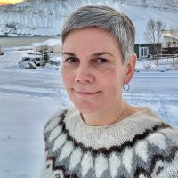

# About me

My name is Ólöf Hannesdóttir and this fall, 2024, I am attending PreFab to prepare myself for Fab Academy in january 2025. I started working as the manager for [Fab Lab Austurland](https://www.fablabs.io/labs/fablabausturland) in the beginning of january 2024 and will be attending Fab Academy to fulfill my contract with my employer, [Verkmenntaskóli Austurlands](https://www.va.is/), which is a small Secondary school in Neskaupstaður, in the east of Iceland. 

I have been teaching arts and crafts in elementary school since 1997 and I graduated from the [University of Iceland](https://english.hi.is/university_of_iceland) with a master´s degree in teaching arts & crafts in february 2024. 

