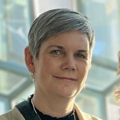
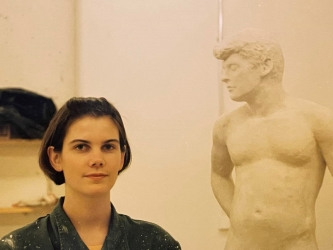
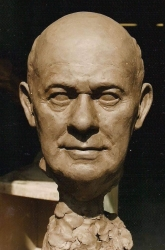

# About me

My name is Ólöf Hannesdóttir and I live in Neskaupstaður, a small town in the east of Iceland. The youngest of our four daughters is finishing her last year in highschool in Akureyri, so for the moment it's only me, my husband and our dog at our place. 

30 years ago I studied sculpture in MHí, which later became the [Icelandic University of the Arts](https://www.lhi.is/). 

       

Later I began teaching and studied pedagogy. I have been teaching arts and crafts in elementary school since 1998 and I graduated from the [University of Iceland](https://english.hi.is/) with a master´s degree in teaching arts & crafts in february 2024.

Ten years ago [Fab Lab Austurland](https://www.fablabs.io/labs/fablabausturland) was opened in my hometown, Neskaupstaður, and I took some classes over the years. I got familiar with the vinyl cutter and the laser cutter. I began teaching groups from 7th grade in Fab Lab and enjoyed teaching there.

I started working as the manager for [Fab Lab Austurland](https://www.fablabs.io/labs/fablabausturland) in the beginning of january 2024 and will be attending Fab Academy to fulfill my contract with my employer, [Verkmenntaskóli Austurlands](https://www.va.is/), which is a small secondary school in Neskaupstaður. This fall, 2024, I am attending PreFab to prepare myself for Fab Academy in january 2025. 

