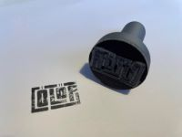
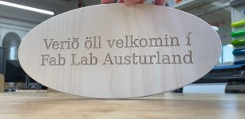
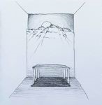

# Home

Welcome to my homepage
My name is Ólöf Hannesdóttir and this is my documentation of Pre Fab Academy 2024. This is the first time that Pre Fab Academy is held in Iceland. [Svavar Konráðsson](https://fabacademy.org/2023/labs/isafjordur/students/svavar-konradsson/index.html) is my instructor and his collegues, [Árni Björnsson](https://fabacademy.org/2022/labs/isafjordur/students/arni-bjornsson/), [Andri Sæmundsson](https://fabacademy.org/2023/labs/akureyri/students/andri-semundsson/pages/aboutMe.html) and [Þórarinn Bjartur Breiðfjörð](https://fabacademy.org/archives/2015/eu/students/gunnarsson.thorarinn_b.b/index.html), assist in this program.

Here you can read [about me](about.md)

